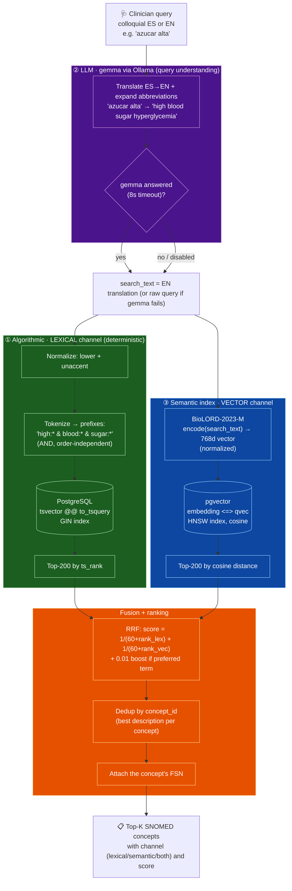
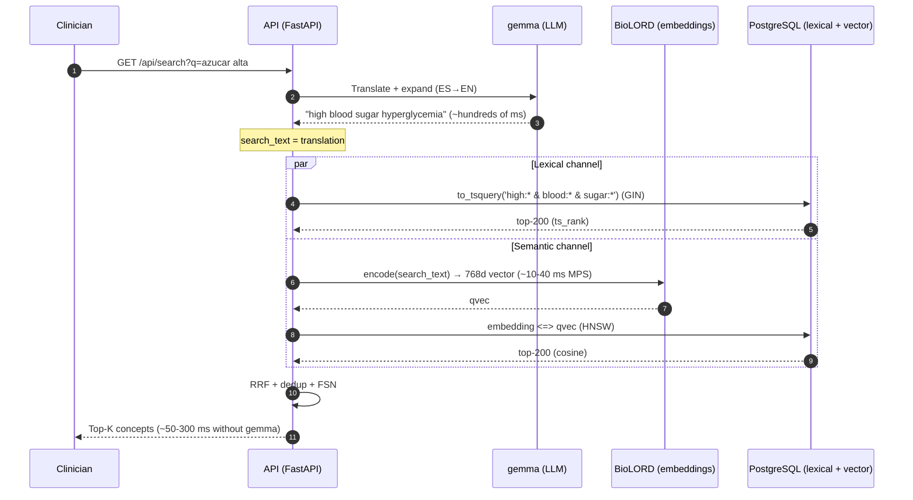
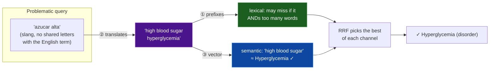

# Hybrid SNOMED CT search — architecture & flow

Reference document for the system we built. It describes how the **three components** cooperate to turn
a clinician's query (colloquial Spanish or English) into the correct SNOMED concept, even when they do
not use the exact words.

The three components:

| # | Component | Nature | Role | Technology |
|---|-----------|--------|------|------------|
| 1 | **Algorithmic (lexical)** | Deterministic | Multi-word prefix matching, order-independent | PostgreSQL `tsvector`/`to_tsquery` + GIN |
| 2 | **LLM (query understanding)** | Generative | Translates the clinician's note (source language selectable) to English and expands abbreviations/localisms | gemma via Ollama (e.g. gemma3:12b), local, OpenAI-compatible |
| 3 | **Semantic index** | Vector | Retrieves by *meaning*, not by letters | BioLORD-2023-M + pgvector HNSW (cosine) |

The **RRF fusion** combines the rankings from (1) and (3); component (2) **prepares** the input for both.

---

## 1. End-to-end flow

---

## 2. Sequence with real (measured) latencies

> **Latency note:** the lexical+vector core answers in ~50–300 ms. gemma adds the largest cost
> (hundreds of ms to seconds); therefore it is cached per query and its failure is **non-blocking**
> (if it does not respond within 8 s, the raw query is used). The first query after startup loads the
> model (~12 s), mitigated with a *warmup* when the server starts.

---

## 3. Component details

### ① Algorithmic — lexical channel (`to_tsquery` multi-prefix, order-independent)
- **What it does:** deterministic matching by **prefixes of all words**, in **any order**.
  `"diab mell"` → `to_tsquery('simple', 'diab:* & mell:*')` → finds *Diabetes mellitus*.
- **How:** column `term_tsv = to_tsvector('simple', term_norm)` + **GIN** index. The `&` requires that
  **all** words appear (high precision); the `:*` allows prefixes (tolerates half-typed words).
- **Strength:** exact, fast, explainable; ideal when the clinician uses the correct vocabulary (or English).
- **Weakness:** blind to meaning. `"azucar alta"` shares no letters with *Hyperglycemia* → 0 results.
  That is why it needs component ② to translate first.
- **Background:** BM25-style lexical retrieval is the standard baseline in [1]; SNOMED's own description
  search uses this same word-prefix-any-order strategy.

### ② LLM — gemma (query understanding / normalization)
- **What it does:** translates the clinician's note from the **selected source language** to English and
  expands abbreviations and localisms into a **standard English clinical phrase**. `"IAM"` (ES) →
  *acute myocardial infarction*; `"EPOC reagudizada"` (ES) → *acute exacerbation of COPD*. The source
  language is passed in explicitly (a UI dropdown), which disambiguates acronyms (e.g. "EPOC" in ES = COPD).
- **Why it is essential** (empirical finding): BioLORD embeds clinical phrases well, but **poorly**
  embeds short Spanish slang. Without translation, `"presion alta"` fell onto *barometric pressure*;
  translated, it correctly hits *Hypertensive disorder*. gemma feeds **BOTH** channels (not only lexical).
- **How:** local Chat Completions call, `temperature=0`, prompt asking for English terms only.
  Best-effort: on failure/timeout the system degrades to the raw query (works for EN input).
- **Does not:** generate embeddings (gemma exposes no `/v1/embeddings`); that is component ③.
- **Background:** the vocabulary-mismatch problem this addresses is well documented for EHR search [4].

### ③ Semantic index — BioLORD + pgvector (retrieval by meaning)
- **What it does:** represents each description as a **768d vector**; retrieves by **cosine proximity**,
  capturing synonyms and paraphrases even when they share no letters.
- **How:** BioLORD-2023-M (biomedical + multilingual, EN/ES among 7 languages) encodes `search_text`;
  pgvector searches neighbors with an **HNSW** index. 1,024,825 descriptions vectorized.
- **Strength:** solves the *vocabulary mismatch* (the project's goal).
- **Weakness:** with ambiguous/colloquial input it loses precision → relies on ② to disambiguate.
- **Background:** the model is BioLORD-2023 [2]; the synonym-alignment idea behind it traces to
  SapBERT [3]; the fine-tuned Triplet-BERT in [1] demonstrated the same principle on SNOMED.

### Fusion — RRF (Reciprocal Rank Fusion)
- Combines the two rankings without calibrating disparate score scales:
  `score(doc) = 1/(60 + rank_lexical) + 1/(60 + rank_semantic) + 0.01·[is_preferred]`.
- A concept appearing in **both** channels rises to the top → `both` badge (highest confidence).
- Then **dedup by concept** (keep the best description) and attach the **FSN** for display.
- **Background:** RRF is the method of Cormack, Clarke & Büttcher [5]; hybrid lexical+semantic retrieval
  is the dominant pattern in the clinical-ontology search literature [1].

---

## 4. How the components cover each other's weaknesses

**Synergy summary:**
- ① provides exact **precision** (and explainability) when the vocabulary matches.
- ② provides **understanding** of the clinician's language (idiom, slang, abbreviations).
- ③ provides **retrieval by meaning** (the heart of the *vocabulary mismatch*).
- **RRF** means it is enough for **one** channel to be right for the correct concept to rise.

---

## 5. Code traceability

| Flow element | Where |
|---|---|
| `search()` orchestration | [`api/search.py`](../api/search.py) |
| ② `gemma_expand()` | `api/search.py` |
| ① `to_prefix_query()` + `RRF_SQL` (CTE `lex`) | `api/search.py` |
| ③ `embed_query()` (BioLORD) + `RRF_SQL` (CTE `vec`) | `api/search.py` |
| RRF fusion + dedup + FSN | `RRF_SQL` (CTEs `fused`/`scored`/`best`) |
| API + demo | [`api/server.py`](../api/server.py), [`demo/index.html`](../demo/index.html) |

---

## 6. References (papers)

1. **Semantic Search for Large Scale Clinical Ontologies** — Chang, Mai, et al. (CSIRO). The closest prior
   work: hybrid lexical (BM25) + semantic (Triplet-BERT over BioBERT) search over SNOMED CT; source of the
   *low lexical-overlap* finding, the Hits@K/nDCG/MRR evaluation, and the synonym-from-hierarchy training
   idea. https://pmc.ncbi.nlm.nih.gov/articles/PMC8861757/
   (Detailed notes: [01-paper-triplet-bert-semantic-search.md](01-paper-triplet-bert-semantic-search.md).)
2. **BioLORD-2023: Semantic Textual Representations Fusing LLM and Clinical Knowledge Graph Insights** —
   Remy, Demuynck, et al., *JAMIA* 31(9):1844, 2024. The embedding model we use (component ③); multilingual
   variant covers ES/EN. https://academic.oup.com/jamia/article/31/9/1844/7614965 · arXiv:2311.16075
   (Notes: [02-biolord-notes.md](02-biolord-notes.md).)
3. **Self-Alignment Pretraining for Biomedical Entity Representations (SapBERT)** — Liu, Shareghi, et al.,
   NAACL 2021. Synonym-aligned biomedical embeddings; the entity-linking + reranking pattern.
   https://aclanthology.org/2021.naacl-main.334/
4. **Designing and Testing a Search Engine for Clinical Notes in EHRs** — NCBI Bookshelf NBK613172.
   Frames the *vocabulary mismatch* that component ② addresses. https://www.ncbi.nlm.nih.gov/books/NBK613172/
5. **Reciprocal Rank Fusion outperforms Condorcet and individual Rank Learning Methods** — Cormack, Clarke &
   Büttcher, *SIGIR* 2009. The RRF fusion method. https://dl.acm.org/doi/10.1145/1571941.1572114
6. **The Probabilistic Relevance Framework: BM25 and Beyond** — Robertson & Zaragoza, 2009. The lexical
   ranking baseline referenced by component ①. https://dl.acm.org/doi/10.1561/1500000019
